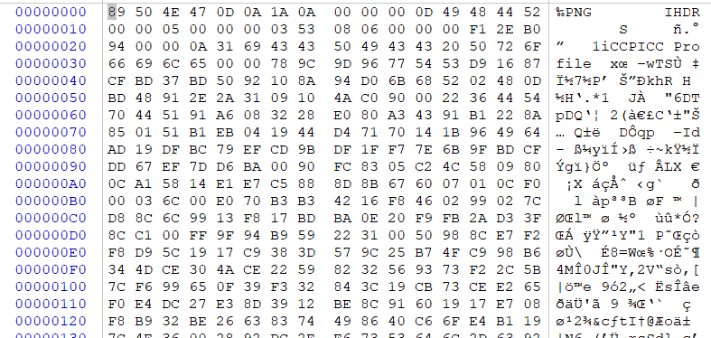

# 🌍 MISC图片类知识点总结

## <mark style="color:red;">1.文件格式分析</mark>

我们先按按照文件格式来对不同类型的图片的格式进行分析后面进行总结。

对于格式的分析建议下载winhex来进行分析和学习。安装包在首页可以自取。

首先介绍png的文件格式

### <mark style="color:orange;">①png</mark>

将一张png图片放到winhex下面看看吧。

<figure><figcaption></figcaption></figure>

#### <mark style="color:yellow;">(1)png文件格式</mark>

png文件从整体上来看主要是由文件头和三组以上的数据块（后面介绍）按照特定的顺序组成，最基本的png至少包括文件头，IHDR,IDAT,IEND组成。用一张图来表示

<figure><figcaption></figcaption></figure>

#### <mark style="background-color:red;">Ⅰ.文件头</mark>

前面的文件头就是下面的

```
89 50 4E 47 0D 0A 1A 0A          
```

<figure><figcaption></figcaption></figure>

#### <mark style="background-color:red;">Ⅱ数据块（Chunk）</mark>

PNG有两种类型的数据块，一个是标准的数据块，另外一个是辅助数据块，我们这里介绍关键数据块，就是我们前面图片中提到的IHDR,PLTE,IDAT,IEND。


#### <mark style="background-color:red;">Ⅲ.IHDR</mark>

这个IHDR是我们会需要知道的。包含了PNG文件中存储的图像数据的基本信息。是文件头之后的第一个数据块。文件头数据块是由13个字节组成的。（这里常常会考改变高度或者宽度来把隐藏的信息显示出来）

我们还是通过WINHEX来介绍。IHDR的16进制是下面的

```
49 48 44 52
```

<figure><figcaption></figcaption></figure>

然后后面就是她的主要内容，一共是13个字节。他的格式网上有表格总结，这里贴过来。我们主要关注前8字节

| 域的名称    | 字节数      | 说明           |
| ------- | -------- | ------------ |
| Width   | 4 bytes  |  图像宽度，以像素为单位 |
| Height  | 4 bytes  | 图像高度，以像素为单位  |

比如在这个winhex里面width为

<figure><figcaption></figcaption></figure>

height为

<figure><figcaption></figcaption></figure>


## 参考门：






